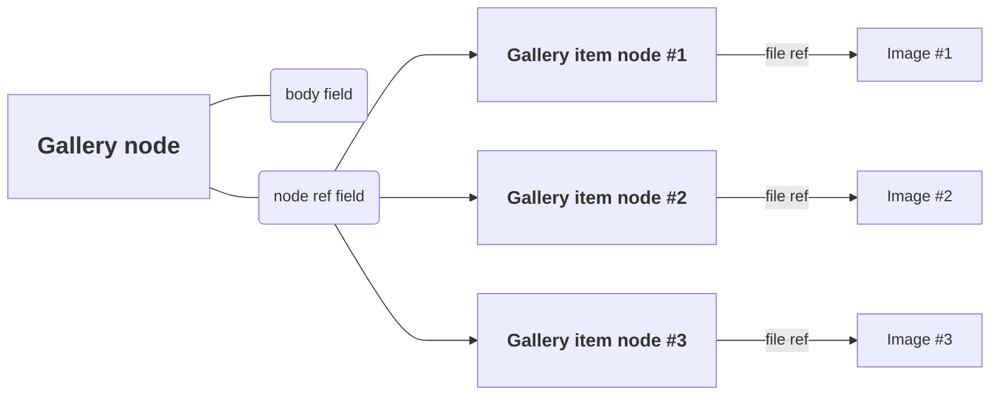
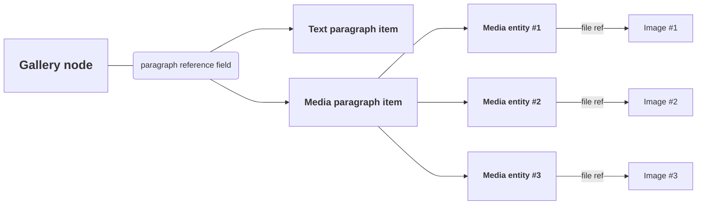

# D7 Migrate example

## Drupal 7 content structure

```mermaid
graph LR;
    G[<h2>Gallery node</h2>]---BODY(body field);
    G---NR(node ref field);
    direction TB;
    NR--->GI1[<h3>Gallery item node #1</h3>];
    NR--->GI2[<h3>Gallery item node #2</h3>];
    NR--->GI3[<h3>Gallery item node #3</h3>];
    GI1--file ref--->GIF1[Image #1];
    GI2--file ref--->GIF2[Image #2];
    GI3--file ref--->GIF3[Image #3];
```

## Drupal 9/10 content structure

```mermaid
graph LR;
    G[<h2>Gallery node</h2>]---PR(paragraph reference field);
    PR--->BODY[<h3>Text paragraph item</h3>];
    PR--->MEDIA[<h3>Media paragraph item</h3>]
    MEDIA--->GI1[<h4>Media entity #1</h4>];
    MEDIA--->GI2[<h4>Media entity #2</h4>];
    MEDIA--->GI3[<h4>Media entity #3</h4>];
    GI1--file ref--->GIF1[Image #1];
    GI2--file ref--->GIF2[Image #2];
    GI3--file ref--->GIF3[Image #3];
```
